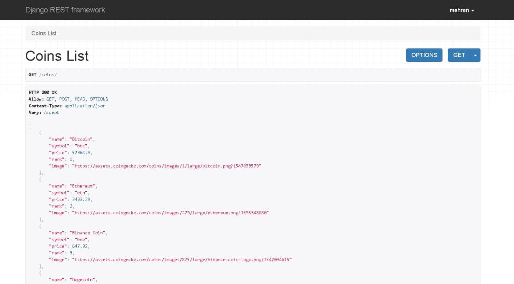

# crypto app for know digital coins price

**this is a simple project**

## Need to be done
- [ ] get dollar USA($) 
- [ ] get RIAL IRAN(ریال) 
- [ ] Conversion dollar to RIAL
- [X] ~~get All digital coins~~
- [X] ~~use drf for api~~
- [X] ~~use celery for Scheduled tasks~~
- [X] ~~use channels for async task~~

# Screen Shots


# Description
### in this app, we first Using celery for request to another site and get informations then using channelse, to cause change price in the moment

# Install required packages and RUN docker container:
```
pip3 install -r requirements.txt
python manage.py makemigrations
python manage.py migrate
python manage.py runserver
celery -A coinerchi beat -l info
celery -A coinerchi worker -P gevent --loglevel=INFO
```


## enjoing
;)
